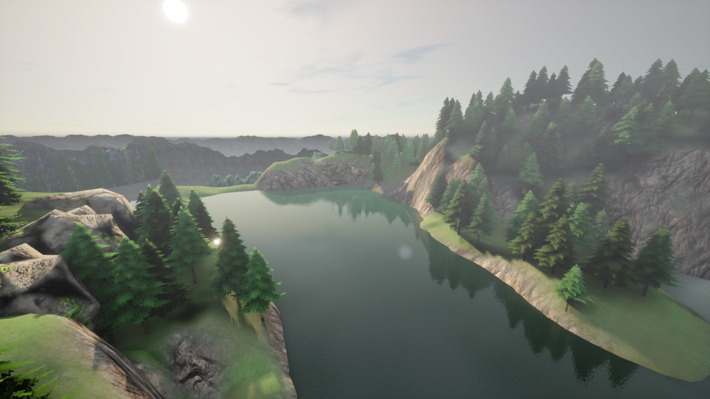
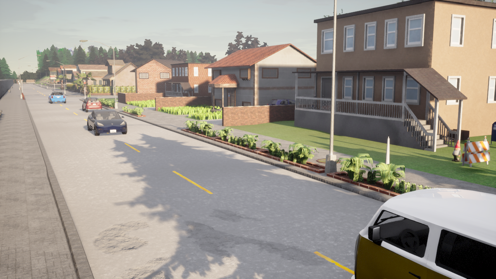

<p align="center">
  <h1 align="center">⚡ Instant4D v2</h1>
  <p align="center">
    <strong>Live incremental 3D scene generation from text — objects spawn one by one in real-time</strong>
  </p>
  <p align="center">
    <em>"A rainy night with police cars at an accident scene"</em> → 🎬 Watch it build live in your browser
  </p>
  <p align="center">
    <a href="#-quick-start">Quick Start</a> •
    <a href="#-how-it-works">How It Works</a> •
    <a href="#-features">Features</a> •
    <a href="#-architecture">Architecture</a> •
    <a href="#%EF%B8%8F-interactive-controls">Controls</a>
  </p>
</p>

---

## 🎨 Generated Scenes

<table>
  <tr>
    <td align="center"><strong>🌧️ "Rainy night emergency response"</strong></td>
    <td align="center"><strong>🏡 "Suburban morning school bus pickup"</strong></td>
  </tr>
  <tr>
    <td></td>
    <td></td>
  </tr>
  <tr>
    <td align="center"><strong>🗺️ Overhead bird's eye view</strong></td>
    <td align="center"><strong>📸 Close-up cinematic angle</strong></td>
  </tr>
  <tr>
    <td></td>
    <td></td>
  </tr>
</table>

> All scenes generated from a single text prompt — objects spawn live in the viewport as you watch.

---

## 🆕 What's New in v2

| v1 | v2 |
|----|-----|
| 6 agents generate Python scripts | 3 agents produce a JSON scene plan |
| Script executed all at once | Objects spawn **one by one** live in viewport |
| Synchronous CARLA mode (blocks streaming) | **Async mode** — streaming camera stays alive during builds |
| Code generation + execution | **No code generation** — JSON plan only |
| Full scene appears after build | **Watch vehicles, props, walkers appear incrementally** |
| ~16 minute pipeline | **~18 minute pipeline** with richer scenes (80-100+ objects) |

---

## ✨ Features

| Feature | Description |
|---------|-------------|
| 🤖 **Multi-Agent Pipeline** | 3 specialized AI agents collaborate to plan, review, and fix scene specifications |
| 🔴 **Live Incremental Building** | Watch objects spawn one-by-one in real-time through the MJPEG stream |
| 💬 **Natural Language Input** | Describe any scene in plain English — the AI handles everything |
| 🎮 **Interactive 3D Viewport** | WASD + mouse FPS controls for real-time scene exploration |
| 📹 **Live MJPEG Streaming** | 15 FPS real-time video from CARLA, directly in your browser |
| 🌦️ **Dynamic Weather** | Rain, night, sunset, fog — AI picks the right weather for your scene |
| 📸 **Multi-Angle Renders** | Automatic captures from 6+ cinematic camera angles |
| 🔄 **Self-Healing Pipeline** | Plan reviewer catches issues, fixer agent patches them before building |
| 🎯 **Fuzzy Blueprint Matching** | Typos in blueprint names are auto-corrected at runtime |
| 🐳 **Docker-Ready** | One script boots CARLA in Docker + all services |

---

## 🚀 Quick Start

### Prerequisites

- **NVIDIA GPU** with Docker GPU support (`nvidia-docker`)
- **Python 3.10+** (main app)
- **Conda** (for CARLA Python 3.7 environment)
- **Claude Code CLI** authenticated (`claude login`)

### 1️⃣ Clone & Install

```bash
git clone https://github.com/seemandhar/Instant4D-v2.git
cd Instant4D-v2
pip install -r requirements.txt
```

### 2️⃣ Set Up CARLA Python Environment

CARLA's Python API requires Python 3.7. Create a separate conda environment:

```bash
conda create -n carla37 python=3.7 -y
conda activate carla37
pip install carla==0.9.13 flask flask-cors numpy Pillow
conda deactivate
```

Update the `CARLA_PYTHON` path in `config.py` and `run.sh` to point to your conda env:
```python
CARLA_PYTHON = "/path/to/miniconda3/envs/carla37/bin/python"
```

### 3️⃣ Launch Everything

```bash
chmod +x run.sh
./run.sh
```

This starts:
- 🐳 **CARLA server** in Docker (GPU-accelerated, offscreen rendering)
- 📹 **Streaming server** on port `5556` (MJPEG + camera controls)
- 🌐 **Web UI** on port `5555` (Flask app + pipeline API)

### 4️⃣ Generate a Scene

Open `http://localhost:5555` in your browser, type a scene description, and hit **Generate Scene**. Watch as objects spawn live in the 3D viewport!

---

## 🧠 How It Works

### Phase 1: AI Planning (~15 min)

```
  "A busy intersection at sunset"
                │
                ▼
  ┌─────────────────────────┐
  │   🎯 Scene Planner      │  Interprets prompt → JSON scene plan
  └────────────┬────────────┘  (map, weather, vehicles, props, cameras)
               │
               ▼
  ┌─────────────────────────┐
  │   🔍 Plan Reviewer      │  Validates blueprints, coordinates,
  └────────────┬────────────┘  weather match, collisions, richness
               │
          ┌────┴────┐
          │Approved?│
          └────┬────┘
         Yes   │   No
          │    │    │
          ▼    │    ▼
        Done   │  ┌─────────────────────────┐
               │  │   🔨 Plan Fixer         │  Fixes invalid blueprints,
               │  └────────────┬────────────┘  coordinates, collisions
               │               │               (max 2 iterations)
               └───────────────┘
```

### Phase 2: Live Incremental Build (~60-90s)

```
  scene_plan.json
        │
        ▼
  ┌─────────────────────────────────────────┐
  │   🏗️ IncrementalBuilder (Python 3.7)    │
  │                                         │
  │   1. Load map (skip if already loaded)  │
  │   2. Clean up previous actors           │
  │   3. Set weather preset                 │
  │   4. Position spectator camera          │
  │   5. Spawn vehicles one by one ──────── │ ── Live in viewport! 🔴
  │   6. Spawn props one by one ─────────── │ ── Live in viewport! 🔴
  │   7. Spawn walkers one by one ───────── │ ── Live in viewport! 🔴
  │   8. Capture from 6+ camera angles      │
  └─────────────────────────────────────────┘
```

The builder runs as a **subprocess** under Python 3.7, streaming JSON events back to the web UI via stdout. Each spawn is visible in real-time through the MJPEG stream.

---

## 🏗️ Architecture

```
Instant4D-v2/
├── 🚀 run.sh                    # One-click launcher (Docker + servers)
├── 🧠 pipeline.py               # Multi-agent orchestration engine
├── 🏗️ incremental_builder.py    # Python 3.10+ wrapper for live building
├── ⚙️ carla_builder_worker.py   # Python 3.7 worker (CARLA API calls)
├── 🌐 web.py                    # Flask web UI + REST API + SSE
├── 📹 carla_stream.py           # MJPEG streaming + camera controls (Python 3.7)
├── ⚙️ config.py                 # Configuration & auth
├── 🤖 agents/
│   ├── definitions.py           # 3 agent prompts + orchestrator template
│   └── __init__.py
├── 🎨 templates/
│   └── index.html               # Web UI with live 3D viewport + build HUD
├── 📦 static/
│   ├── css/style.css            # Dark theme + build progress overlay
│   └── js/app.js                # Interactive controls + SSE client
├── 📋 requirements.txt
├── 🗂️ workspace_demo/           # Pre-built demo scene plan
└── 🖼️ assets/                   # Demo screenshots
```

### Dual Python Architecture

| Component | Python | Purpose |
|-----------|--------|---------|
| `pipeline.py`, `web.py`, `incremental_builder.py` | 3.10+ | Claude Agent SDK, Flask, builder wrapper |
| `carla_builder_worker.py`, `carla_stream.py` | 3.7 (conda) | CARLA Python API, MJPEG streaming |

The builder uses a **subprocess architecture**: the Python 3.10+ wrapper writes the scene plan to a temp JSON file, launches the Python 3.7 worker, and reads JSON-line events from its stdout.

### Key Design Decisions

- **Never synchronous mode**: The streaming camera stays alive during builds — v1's `synchronous_mode` would kill the MJPEG stream
- **JSON-only plans**: No code generation reduces errors and makes plans reviewable
- **Fuzzy blueprint matching**: `find_bp()` auto-corrects typos (e.g., `vehicle.mercedes-benz.coupe` → `vehicle.mercedes.coupe`)
- **Spawn point fallback**: Vehicles try exact position → nearest spawn point → arbitrary spawn point
- **Z-retry ladder**: Vehicles retry at z = [0.5, 1.0, 1.5, 2.0] to find unblocked positions

---

## 🎮️ Interactive Controls

Once a scene is generated, explore it in real-time through the live 3D viewport:

| Control | Action |
|---------|--------|
| `W` `A` `S` `D` | Move forward / left / backward / right |
| `Q` / `Space` | Fly up |
| `E` / `C` | Fly down |
| `Mouse` | Look around (click viewport to capture) |
| `Scroll` | Zoom in / out |
| `Shift` | Fast movement |
| `Escape` | Release mouse capture |

Weather and map can be changed on-the-fly from the **Controls** tab.

---

## 🔌 API Reference

### Generate Scene (Full Pipeline)
```bash
POST /api/generate
Content-Type: application/json

{"prompt": "A parking lot with sports cars at sunset", "model": "sonnet"}
# Returns: {"job_id": "abc123", "status": "running"}
```

### Build Scene (Direct, skip AI pipeline)
```bash
POST /api/build
Content-Type: application/json

{"plan_path": "/path/to/scene_plan.json"}
# Or inline: {"plan": {...}}
```

### Load Demo Scene
```bash
POST /api/load_demo
# Builds the included demo scene incrementally
```

### Pipeline Events (SSE)
```bash
GET /api/events/<job_id>
# Server-Sent Events: build_phase, build_spawn, build_capture, build_complete
```

### Scene Control
```bash
POST /api/control
Content-Type: application/json

{"action": "weather", "preset": "HardRainNight"}
{"action": "camera", "x": 10, "y": 0, "z": 20, "pitch": -30, "yaw": 45}
{"action": "clear_scene"}
{"action": "get_scene_info"}
{"action": "snapshot"}
```

### Camera Control (Streaming Server)
```bash
POST http://localhost:5556/control
Content-Type: application/json

{"command": "set_position", "x": 10, "y": 0, "z": 20, "pitch": -30, "yaw": 45}
{"command": "set_weather", "preset": "HardRainNight"}
{"command": "move_forward", "speed": 3}
```

### Live Stream
```
GET http://localhost:5556/stream     # MJPEG video stream
GET http://localhost:5556/snapshot   # Single JPEG frame
GET http://localhost:5556/info       # Camera state + FPS
```

---

## 🌦️ Supported Weather Presets

| ☀️ Clear | ☁️ Cloudy | 🌧️ Wet | 🌧️ Soft Rain | ⛈️ Mid Rain | 🌊 Hard Rain |
|----------|----------|---------|-------------|------------|-------------|
| ClearNoon | CloudyNoon | WetNoon | SoftRainNoon | MidRainyNoon | HardRainNoon |
| ClearNight | CloudyNight | WetNight | SoftRainNight | MidRainyNight | HardRainNight |
| ClearSunset | CloudySunset | WetSunset | SoftRainSunset | MidRainSunset | HardRainSunset |

---

## 📊 Performance

Tested on NVIDIA GPU with CARLA 0.9.13 Docker:

| Scene | Objects Planned | Spawned | Build Time | Total Pipeline |
|-------|:-:|:-:|:-:|:-:|
| Sunny park (demo) | 37 | 36 (97%) | 33s | N/A (direct) |
| Rainy night accident | 103 | 99 (96%) | 83s | ~27 min |
| Suburban morning | 100 | 97 (97%) | 83s | ~18 min |

Build phase is consistently fast (~0.5s per object). Pipeline time depends on AI plan review iterations.

---

## 📦 Available CARLA Assets

- **25+ Vehicle types** — Tesla, Mercedes, BMW, Audi, Police cars, Ambulance, Motorcycles, VW Bus
- **50+ Static props** — Benches, trash cans, traffic cones, barriers, bus stops, ATMs, vending machines, debris, plant pots
- **49 Pedestrian models** — Diverse walker blueprints for crowd scenes
- **6 Maps** — Town01-05 + Town10HD (modern downtown, best visual quality)

---

## ⚙️ Configuration

Edit `config.py` to customize:

```python
@dataclass
class PipelineConfig:
    carla_host: str = "localhost"
    carla_port: int = 2000
    image_width: int = 1280          # Render resolution
    image_height: int = 720
    max_review_iterations: int = 2   # Plan review rounds
    max_fix_iterations: int = 2      # Plan fix rounds
    default_map: str = "/Game/Carla/Maps/Town10HD_Opt"
```

Launch options in `run.sh`:
```bash
./run.sh --gpu 0          # Use GPU 0 for CARLA
./run.sh --port 8080      # Web UI on port 8080
./run.sh --no-carla       # Skip Docker (CARLA already running)
```

---

## 🤝 Built With

- [**CARLA Simulator**](https://carla.org/) — Open-source autonomous driving simulator (UE4)
- [**Claude Agent SDK**](https://docs.anthropic.com/en/docs/claude-agent-sdk) — Multi-agent orchestration framework by Anthropic
- [**Claude (Sonnet/Opus)**](https://anthropic.com/claude) — AI models powering each agent
- [**Flask**](https://flask.palletsprojects.com/) — Lightweight Python web framework
- [**Docker**](https://www.docker.com/) — Containerized CARLA server

---

## 📄 License

MIT License — see [LICENSE](LICENSE) for details.

---

<p align="center">
  <strong>⚡ Instant4D v2 — Turn words into worlds, live.</strong><br>
  <em>Watch your scene build itself, one object at a time.</em>
</p>
