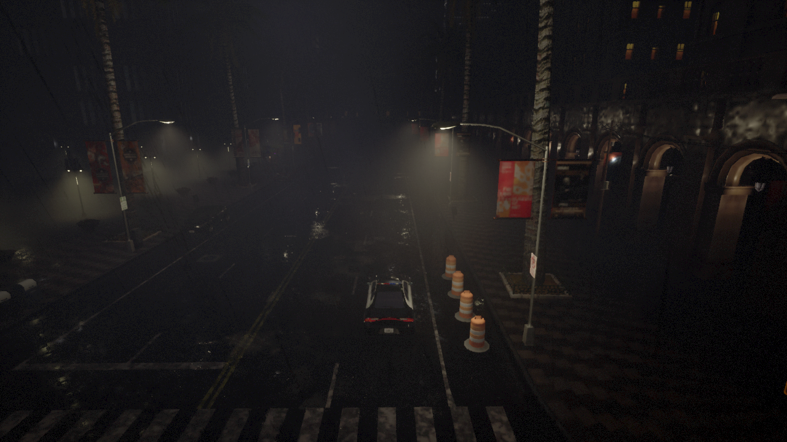
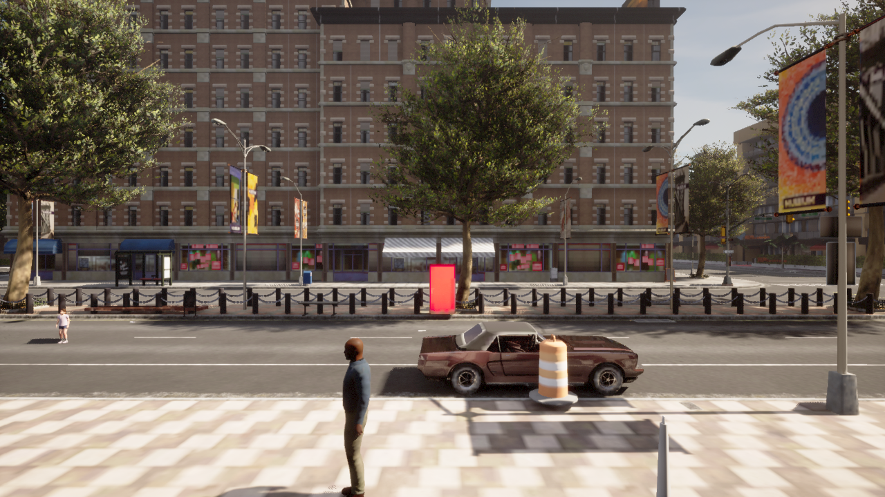
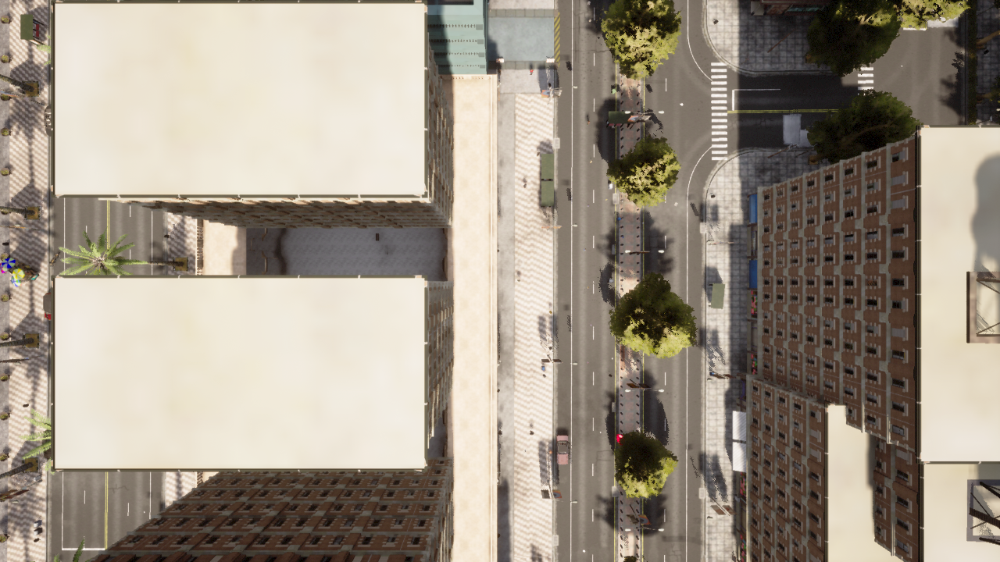
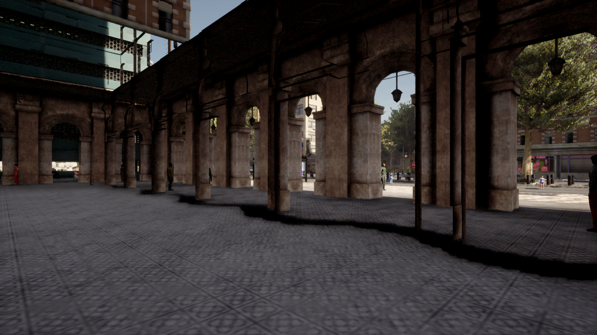

<p align="center">
  <h1 align="center">⚡ Instant4D</h1>
  <p align="center">
    <strong>Instant 3D scene generation from text using multi-agent AI + CARLA simulator</strong>
  </p>
  <p align="center">
    <em>"A rainy night with police cars blocking the road"</em> → 🎬 Fully rendered 3D scene in seconds
  </p>
  <p align="center">
    <a href="#-quick-start">Quick Start</a> •
    <a href="#-how-it-works">How It Works</a> •
    <a href="#-features">Features</a> •
    <a href="#-architecture">Architecture</a> •
    <a href="#%EF%B8%8F-interactive-controls">Controls</a>
  </p>
</p>

---

## 🎨 Generated Scenes

<table>
  <tr>
    <td align="center"><strong>🌧️ "Rainy night police roadblock"</strong></td>
    <td align="center"><strong>🏙️ "NYC street scene at noon"</strong></td>
  </tr>
  <tr>
    <td></td>
    <td></td>
  </tr>
  <tr>
    <td align="center"><strong>🗺️ Overhead bird's eye view</strong></td>
    <td align="center"><strong>🚶 Pedestrian point of view</strong></td>
  </tr>
  <tr>
    <td></td>
    <td></td>
  </tr>
</table>

> All scenes generated from a single text prompt — no manual placement, no scripting.

---

## ✨ Features

| Feature | Description |
|---------|-------------|
| 🤖 **Multi-Agent Pipeline** | 6 specialized AI agents collaborate to plan, build, review, render, and fix 3D scenes |
| 💬 **Natural Language Input** | Describe any scene in plain English — the AI handles everything |
| 🎮 **Interactive 3D Viewport** | WASD + mouse FPS controls for real-time scene exploration |
| 📹 **Live MJPEG Streaming** | 15 FPS real-time video from CARLA, directly in your browser |
| 🌦️ **Dynamic Weather** | Rain, night, sunset, fog — switch weather in real-time |
| 📸 **Multi-Angle Renders** | Automatic captures from 4+ camera angles per scene |
| 🔄 **Self-Healing Pipeline** | Quality checker identifies issues, fixer agent patches and re-renders automatically |
| 🐳 **Docker-Ready** | One script boots CARLA in Docker + all services |

---

## 🚀 Quick Start

### Prerequisites

- **NVIDIA GPU** with Docker GPU support (`nvidia-docker`)
- **Python 3.10+** (main app)
- **Conda** (for CARLA Python 3.7 environment)
- **Claude Code CLI** authenticated (`claude login`)

### 1️⃣ Clone & Install

```bash
git clone https://github.com/seemandhar/Instant4D.git
cd Instant4D
pip install -r requirements.txt
```

### 2️⃣ Set Up CARLA Python Environment

CARLA's Python API requires Python 3.7. Create a separate conda environment:

```bash
conda create -n carla37 python=3.7 -y
conda activate carla37
pip install carla==0.9.13 flask flask-cors numpy Pillow
conda deactivate
```

Update the `CARLA_PYTHON` path in `config.py` and `run.sh` to point to your conda env:
```python
CARLA_PYTHON = "/path/to/miniconda3/envs/carla37/bin/python"
```

### 3️⃣ Launch Everything

```bash
chmod +x run.sh
./run.sh
```

This starts:
- 🐳 **CARLA server** in Docker (GPU-accelerated, offscreen rendering)
- 📹 **Streaming server** on port `5556` (MJPEG + camera controls)
- 🌐 **Web UI** on port `5555` (Flask app + pipeline API)

### 4️⃣ Generate a Scene

Open `http://localhost:5555` in your browser, type a scene description, and hit **Generate Scene**. Watch as 6 AI agents collaborate to bring your scene to life!

---

## 🧠 How It Works

```
  "A busy intersection at sunset"
                │
                ▼
  ┌─────────────────────────┐
  │   🎯 Scene Planner      │  Interprets prompt → JSON scene spec
  └────────────┬────────────┘  (map, weather, vehicles, props, cameras)
               │
               ▼
  ┌─────────────────────────┐
  │   🔧 Object Placer      │  JSON spec → executable Python script
  └────────────┬────────────┘  (CARLA API calls, spawn commands)
               │
               ▼
  ┌─────────────────────────┐
  │   🔍 Code Reviewer      │  Validates script for correctness
  └────────────┬────────────┘  (API usage, coordinates, error handling)
               │
               ▼
  ┌─────────────────────────┐
  │   🎬 Scene Renderer     │  Executes script in CARLA
  └────────────┬────────────┘  (spawns actors, captures images)
               │
               ▼
  ┌─────────────────────────┐
  │   ✅ Quality Checker    │  Assesses results (score 0-100)
  └────────────┬────────────┘  (missing objects, spawn failures)
               │
          ┌────┴────┐
          │ Score≥70?│
          └────┬────┘
         Yes   │   No
          │    │    │
          ▼    │    ▼
        Done   │  ┌─────────────────────────┐
               │  │   🔨 Scene Fixer        │  Patches script + re-renders
               │  └────────────┬────────────┘  (up to 3 fix iterations)
               │               │
               └───────────────┘
```

The entire pipeline is orchestrated by a master agent using [`claude-agent-sdk`](https://docs.anthropic.com/en/docs/claude-agent-sdk), with each specialized agent running as a subagent.

---

## 🏗️ Architecture

```
Instant4D/
├── 🚀 run.sh                # One-click launcher (Docker + servers)
├── 🧠 pipeline.py           # Multi-agent orchestration engine
├── 🌐 web.py                # Flask web UI + REST API
├── 📹 carla_stream.py       # MJPEG streaming + camera controls (Python 3.7)
├── ⚙️ config.py             # Configuration & auth
├── 🤖 agents/
│   ├── definitions.py       # 6 agent prompts + orchestrator template
│   └── __init__.py
├── 🎨 templates/
│   └── index.html           # Web UI with live 3D viewport
├── 📦 static/
│   ├── css/style.css        # Dark theme UI styles
│   └── js/app.js            # Interactive controls + SSE client
├── 📋 requirements.txt
└── 🖼️ assets/               # Demo screenshots
```

### Dual Python Architecture

| Component | Python Version | Purpose |
|-----------|---------------|---------|
| `pipeline.py`, `web.py` | 3.10+ | Claude Agent SDK, Flask web UI |
| `carla_stream.py` | 3.7 (conda) | CARLA Python API, MJPEG streaming |

This split is necessary because CARLA 0.9.13's Python bindings are compiled for Python 3.7 only, while `claude-agent-sdk` requires modern Python.

---

## 🎮️ Interactive Controls

Once a scene is generated, explore it in real-time through the live 3D viewport:

| Control | Action |
|---------|--------|
| `W` `A` `S` `D` | Move forward / left / backward / right |
| `Q` / `Space` | Fly up |
| `E` / `C` | Fly down |
| `Mouse` | Look around (click viewport to capture) |
| `Scroll` | Zoom in / out |
| `Shift` | Fast movement |
| `Escape` | Release mouse capture |

Weather and map can be changed on-the-fly from the **Controls** tab.

---

## 🔌 API Reference

### Generate Scene
```bash
POST /api/generate
Content-Type: application/json

{"prompt": "A parking lot with sports cars at sunset", "model": "sonnet"}
```

### Pipeline Events (SSE)
```bash
GET /api/events/<job_id>
# Server-Sent Events stream with real-time pipeline progress
```

### Camera Control (Streaming Server)
```bash
POST http://localhost:5556/control
Content-Type: application/json

{"command": "set_position", "x": 10, "y": 0, "z": 20, "pitch": -30, "yaw": 45}
{"command": "set_weather", "preset": "HardRainNight"}
{"command": "move_forward", "speed": 3}
{"command": "rotate", "dyaw": 10, "dpitch": -5}
```

### Live Stream
```
GET http://localhost:5556/stream     # MJPEG video stream
GET http://localhost:5556/snapshot   # Single JPEG frame
GET http://localhost:5556/info       # Camera state + FPS
```

---

## 🌦️ Supported Weather Presets

| ☀️ Clear | ☁️ Cloudy | 🌧️ Wet | 🌧️ Soft Rain | ⛈️ Mid Rain | 🌊 Hard Rain |
|----------|----------|---------|-------------|------------|-------------|
| ClearNoon | CloudyNoon | WetNoon | SoftRainNoon | MidRainyNoon | HardRainNoon |
| ClearNight | CloudyNight | WetNight | SoftRainNight | MidRainyNight | HardRainNight |
| ClearSunset | CloudySunset | WetSunset | SoftRainSunset | MidRainSunset | HardRainSunset |

---

## 📦 Available CARLA Assets

- **15+ Vehicle types** — Tesla, Mercedes, BMW, Police cars, Ambulance, Motorcycles
- **40+ Static props** — Benches, trash cans, traffic cones, barriers, bus stops, ATMs, vending machines
- **47 Pedestrian models** — Diverse walker blueprints for crowd scenes
- **6 Maps** — Town01-05 + Town10HD (modern downtown, best visual quality)

---

## ⚙️ Configuration

Edit `config.py` to customize:

```python
@dataclass
class PipelineConfig:
    carla_host: str = "localhost"
    carla_port: int = 2000
    image_width: int = 1280          # Render resolution
    image_height: int = 720
    max_review_iterations: int = 2   # Code review rounds
    max_fix_iterations: int = 3      # Quality fix rounds
```

Launch options in `run.sh`:
```bash
./run.sh --gpu 0          # Use GPU 0 for CARLA
./run.sh --port 8080      # Web UI on port 8080
./run.sh --no-carla       # Skip Docker (CARLA already running)
```

---

## 🤝 Built With

- [**CARLA Simulator**](https://carla.org/) — Open-source autonomous driving simulator (UE4)
- [**Claude Agent SDK**](https://docs.anthropic.com/en/docs/claude-agent-sdk) — Multi-agent orchestration framework by Anthropic
- [**Claude (Sonnet/Opus)**](https://anthropic.com/claude) — AI models powering each agent
- [**Flask**](https://flask.palletsprojects.com/) — Lightweight Python web framework
- [**Docker**](https://www.docker.com/) — Containerized CARLA server

---

## 📄 License

MIT License — see [LICENSE](LICENSE) for details.

---

<p align="center">
  <strong>⚡ Instant4D — Turn words into worlds.</strong><br>
  <em>Built with Claude + CARLA</em>
</p>
